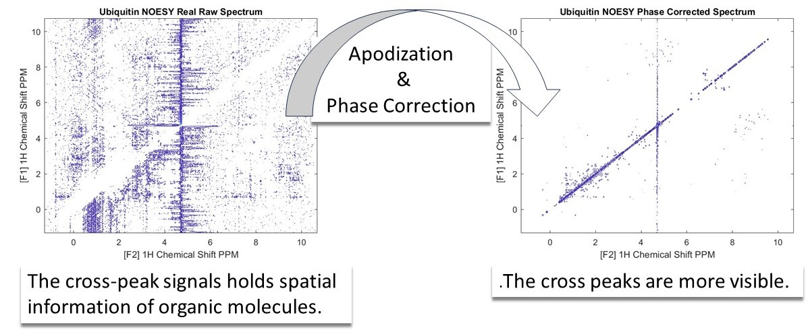

## 6. Processing 2D NMR NOESY   

In this example, we have introduced the Nuclear Overhauser Effect Spectroscopy (NOESY). This technique plays a crucial role in elucidating the spatial arrangement of atoms within a molecule, particularly in the study of biomolecules like proteins and nucleic acids.
To interpret the NOESY spectra the time domain data needs to be processed so we can identify the individual peaks. This is done by enhancing signals through apodization and phase correction. Applying phase correction on both dimensions of the spectrum makes the cross peaks more easily visible. (see the above figure). This NMR data is kindly provided by Prof. Ilya Kuprov, University of Southampton.  

### Usage

This code can be opened in [MATLAB® Online™](https://matlab.mathworks.com/).

